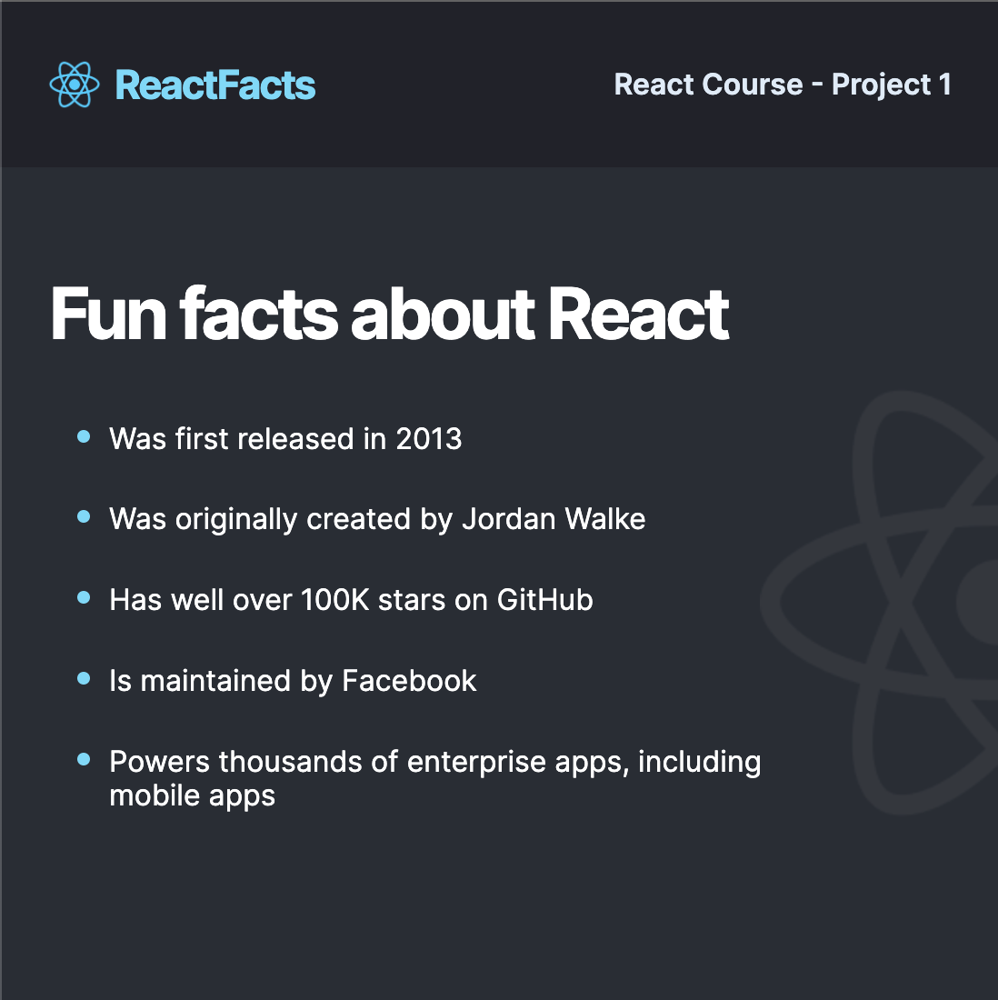
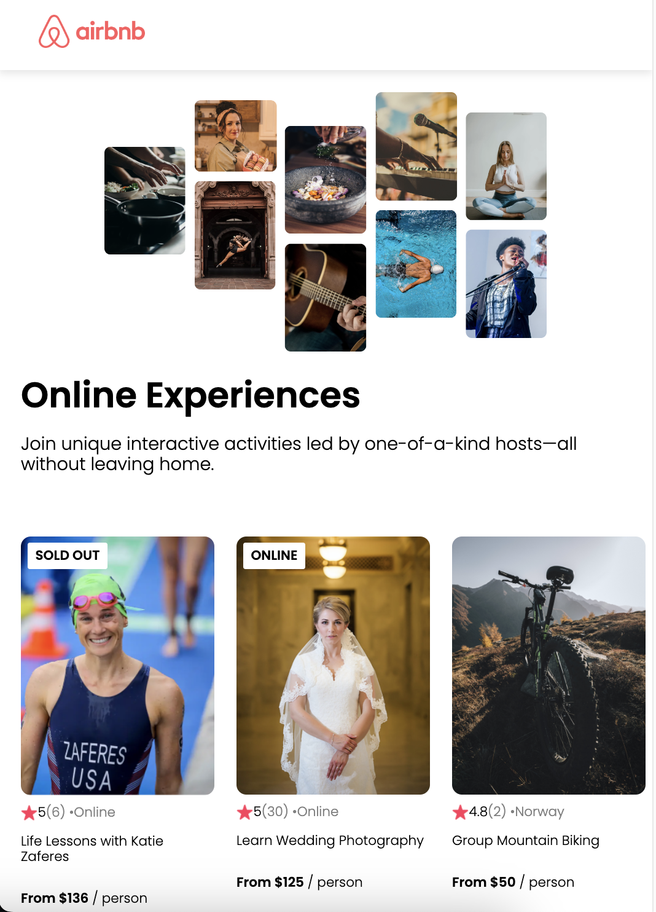
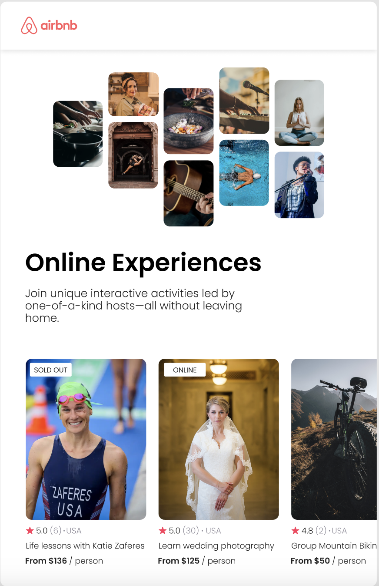

# Scrimba-React-Course

## 1. React Info Site
[Figma design](https://www.figma.com/file/SjQ2D7Vo9JIZCVm9lRHTkJ/ReactFacts-(Copy)?type=design&node-id=0%3A1&t=tNP4aALHx5u1OVzB-1)

### Final website
<!--  -->

### Figma mockup

## 2. AirBnB Clone
[Figma design](https://www.figma.com/file/MbEAo1iVPa3NGj2zJ57G6p/Airbnb-Experiences-(Copy)?type=design&node-id=0%3A1&mode=design&t=GNDNRfBbrgDENpFX-1)

### Final website
<!--  -->

### Figma mockup

